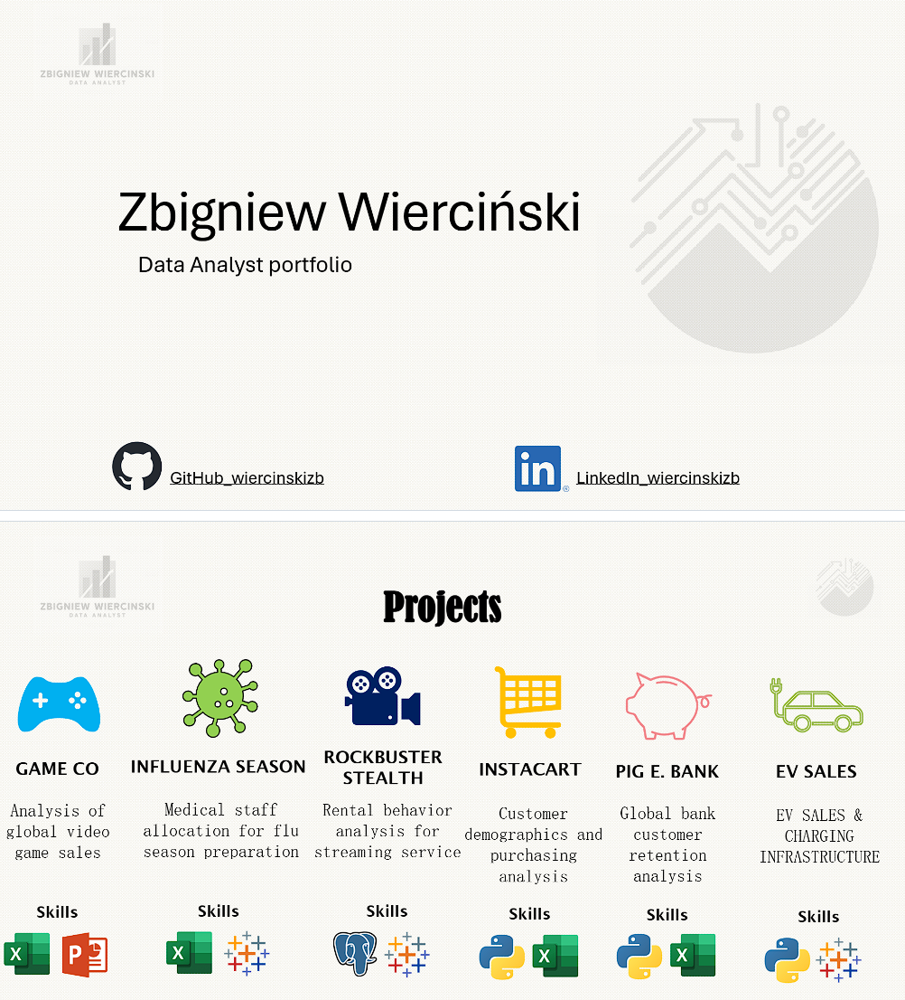

Welcome to my Data Analyst portfolio.  
🔗 [My GitHub Profile](https://github.com/wiercinskizb)  
🔗 [My LinkedIn Profile](https://www.linkedin.com/in/wiercinskizb/)  
🔗 [Portfolio Website](https://wiercinskizb.github.io/wiercinskizb-portfolio/)
🔗 [Resume](https://github.com/wiercinskizb/wiercinskizb-portfolio/blob/main/Wiercinski-Zbigniew-Resume.pdf)

This portfolio includes projects such as:
- Instacart Case Study (Python, pandas)
- Rockbuster Stealth (SQL, Tableau)
- EV Market Analysis (Python, Tableau)
- Flu Season Staffing Plan (Tableau, Statistics)

Check them out in the live site or in the `Projects` section above.
